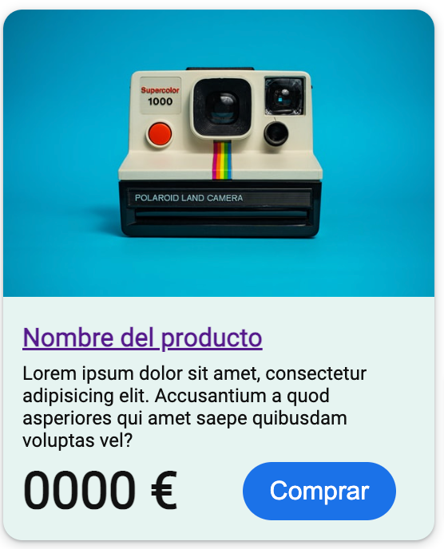

# dile-product-card
Basic product card for a e-commerce based on Lit Element

# Basic card (Responsive)
You are able to add an image and/or personalize your own text.

## How to use?

Change the value you want to replace using the variables.

## Links

## Preview

[!(img/Demo-Dile-Product-demo.png)](img/Demo-Dile-Product-demo.png )

## Variables:

### Text
- "main_title"
- "img_src"
- "img_alt"
- "product_title"
- "product_subtitle"
- "product_text"
- "product_price"
- "btn_text"

### CSS

### Mobile and desktop

 -  --color-text: Title and text color
-   --color-subtext: Subtitle and price color
-   --color-bg-first: Bg color of image
-   --color-bg-second: Bg color of text
-   --color-border: Border color
  
  ### Mobile
  
-  --font-opacity: Subtitle opacity
-   --font-main-title: Title size
-   --font-title: Title size (Behind image)
-   --font-subtitle: Subtitle size
-   --font-text: Text size
-   --font-price: Price size
-   --font-btn: Button size
  
  ### Desktop
  
-   --fontDS-main-title:  Title size
-   --fontDS-title:  Title size (Behind image)
-   --fontDS-subtitle: Subtitle size
-   --fontDS-text: Text size
-   --fontDS-price: Price size
-   --fontDS-btn: Button size
  
##   Author

## License

Under MIT License